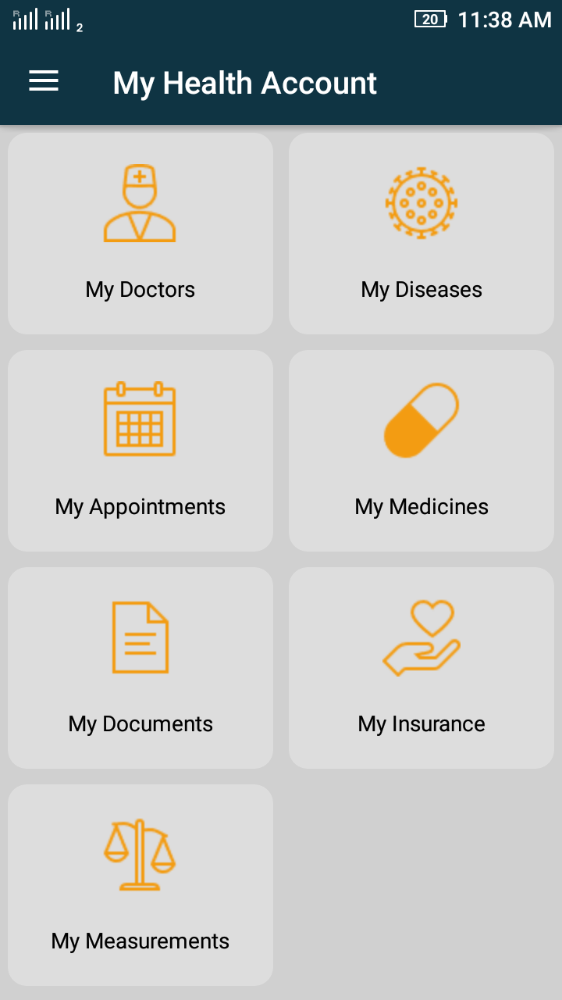
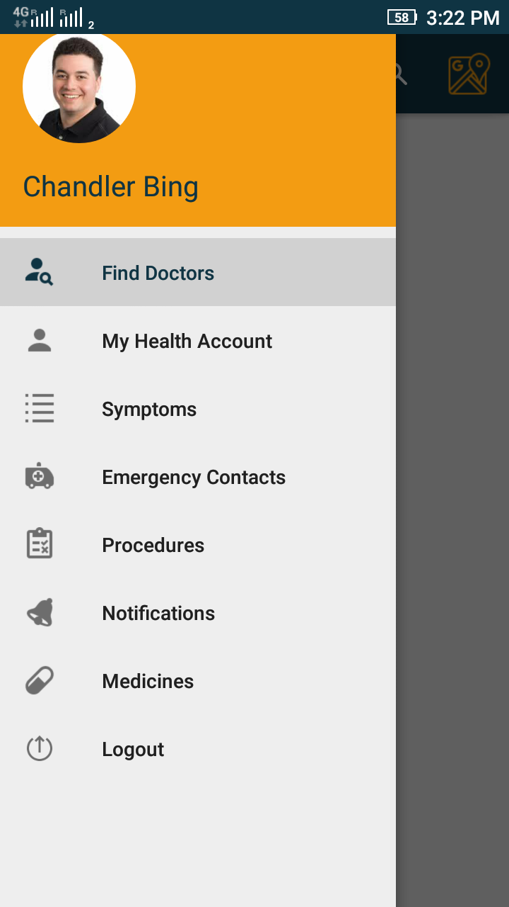

# Doctor
This is medical health app which enable the user to ”identify his illness and find specialized doctors in a simple and direct manner”.Keeping in mind the ease of usage,
developed an Android application for medical care. The basic work flow of the project begins with the user being able to locate his/her body parts visually, identify the symptoms and thus find the possible disease. The specialized doctors of the body part and
the possible diseases are listed to the user. The user can then filter his results on various parameters, view the doctor’s details and directly request an appointment and get
notifications.

